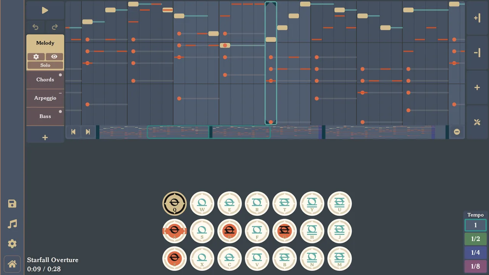
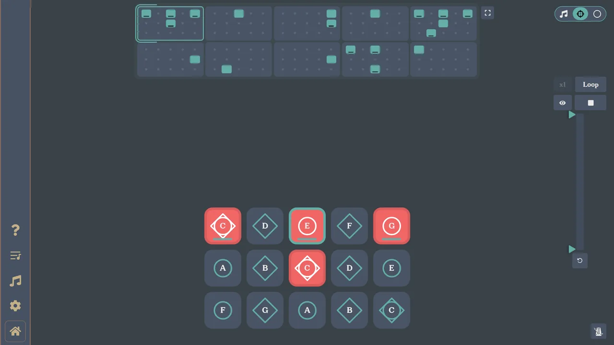

# 欢迎来到原神音乐和光遇音乐之夜

此项目保存原神和光遇两个音乐应用程序的代码, 您可以在上查看已发布的应用程序 [specy.app](https://specy.app)

# 如何在开发模式下运行

你需要在你的计算机上安装node.js，你可以在 [这里](https://nodejs.org/en/)下载.

然后将仓库克隆到一个文件夹中，并使用 `npm install` 安装依赖项，如果失败，可以使用`npm install --force` 强制安装。

不要使用 npm run start 来启动开发服务器，会提示没有这个文件

使用 `npm run dev:sky` 或 `npm run dev:genshin` 来启动原神或光遇的开发服务器

你可以使用 `npm run build:genshin` 或 `npm run build:sky` 构建静态文件, 或者使用 `npm run build:all` 构建两个程序的

使用 `npm run build:{APPname}-no-root` 构建的静态文件是放在二级目录的，例如：www\*****\skyMuisc\

使用 `npm run preview:genshin` 或 `npm run preview:sky` 来启动已经构建好的服务器 (使用这种方法可以大幅减少资源占用)

# 寻找翻译人员

我正在寻找有人帮助我将我的应用程序翻译成其他语言，
如果您感兴趣，请参照翻译[讨论](https://github.com/Specy/genshin-music/discussions/52)

# 资料

你可以在[这里](https://github.com/Specy/genshin-music/wiki)找到应用程序的资料
它不是很详细，但可能有助于理解这种格式是如何工作的。

# 如何参与项目

添加一个新的问题，说明你想做什么，然后等待我分配问题。通过这种方式，我们还可以沟通修复/添加问题是否有效。

# README.MD

<a href="./README.md">English</a> | <a href="./README-ZH.md">简体中文</a> | <a href="./README-JP.md">日本語</a> | <a href="./README-TR.md">Türkçe</a> | <a href="./README-ID.md">Indonesian</a>
