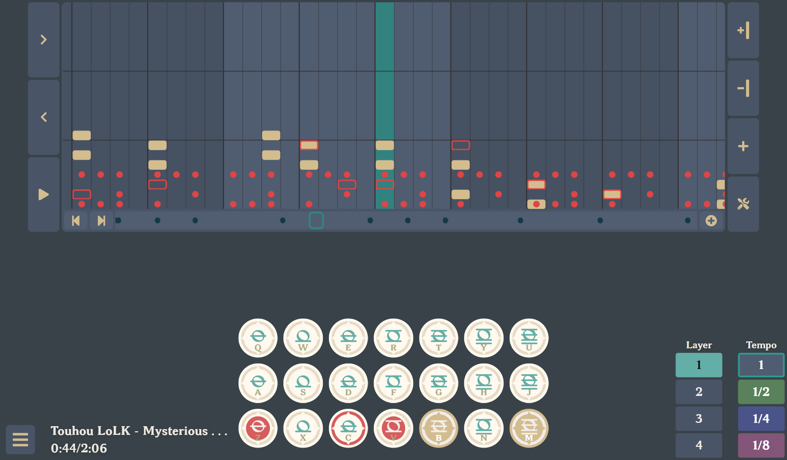
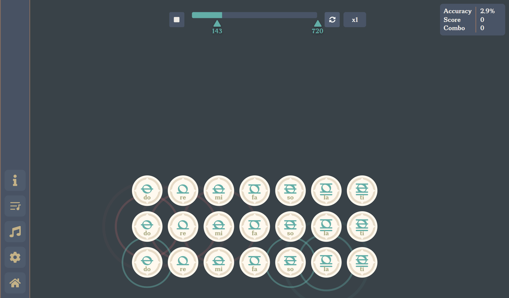

# Welcome to Genshin music and Sky music nightly

This repository holds the code relative to the two music apps for Genshin and sky cotl, you can see the published apps at https://specy.app

# How to run
You need node.js and yarn installed, if you don't have yarn, install it with `npm i yarn --global`.
Then clone the repo to a folder and install the dependencies with `yarn install`, once installed, run the development server with `yarn start`

There are 4 more scripts which might be useful, run as a specific app and build as a specific app.

You can run `yarn startSky` or `yarn startGenshin`, this will run the webapps for the specific game and swap the assets. 

# How to build

You can use the scripts `yarn buildGenshin` and `yarn buildSky` which will build the correct app, or `yarn buildAll` to build both

# Documentation
You can find the documentation of the app [here](https://github.com/Specy/genshin-music/wiki)

# How to contribute
Make a new issue saying what you want to work on and wait for me to assign the issue. This way we can also communicate whether or it would be a valid issue to fix/add
