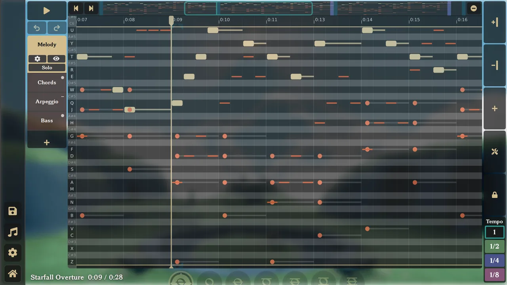
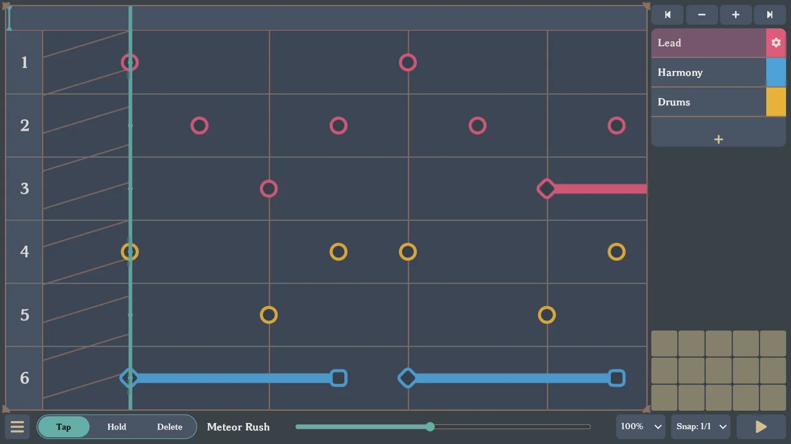
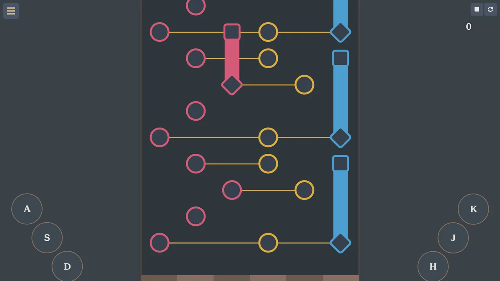
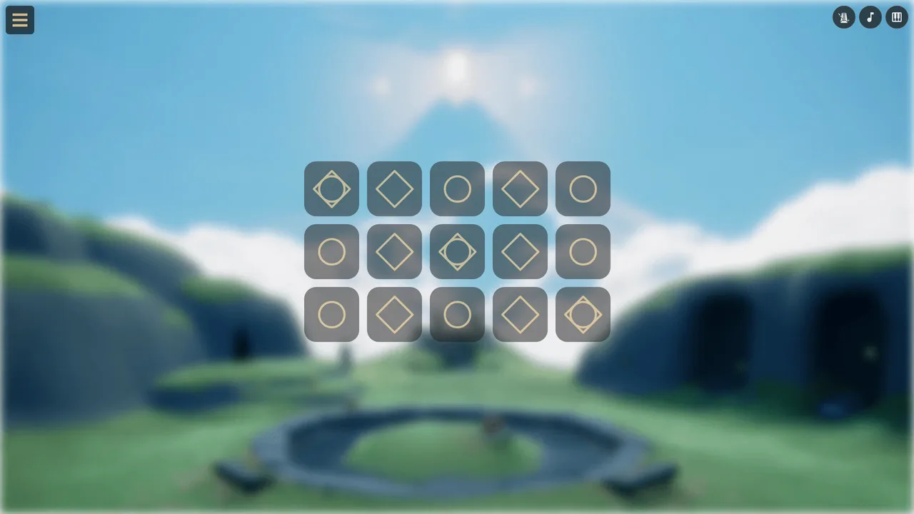

# Welcome to Genshin music and Sky music nightly

This repository holds the code of the two music apps for Genshin and Sky Cotl, you can see the published apps at [specy.app](https://specy.app)

# A look at the apps

Both apps are built from this one codebase, so the screenshots below are a mix of the two.

Practice a song note by note:

Write songs with as many instruments as you want in the composer:

The same song in the PRO composer, shown with a different theme:

Rhythm game charts, with tap and held notes, are written in the VSRG composer:

...and played in the VSRG player:

Every page follows the theme you pick, the zen keyboard here uses that same "Sky Music" theme:

# Looking for help in translation

I'm looking for people who could help me translate the app to other languages, if you are interested, [look at the translation discussion here](https://github.com/Specy/genshin-music/discussions/52)

# How to run in dev mode

You need Node.js >= 20.19 installed on your computer, you can get it [here](https://nodejs.org/en/).
Then clone the repo to a folder and install the dependencies with `npm i`.

You always run a specific game, this will run the webapp for that game and swap the assets in:

You can run `npm run dev:sky` or `npm run dev:genshin`.

Note: there is also a plain `npm run dev`, but it skips the per-game asset setup step, so it is not a supported way to run the app - always use one of the two commands above.

# How to build

You can use the scripts `npm run build:genshin` and `npm run build:sky` which will build the correct app, or `npm run build:all` to build both. These build for hosting each app at the root of its own domain.

If instead you want to host both apps on the same domain under a subpath (e.g. `example.com/genshinMusic`, `example.com/skyMusic`), use `npm run build:genshin-no-root`, `npm run build:sky-no-root` or `npm run build:all-no-root`.

Once you have a build, you can serve it locally with `npm run preview:genshin` or `npm run preview:sky`.

# Tech stack

The app is built with SvelteKit 2 and Svelte 5 in TypeScript. The Composer, VSRG Composer and VSRG Player pages render their canvases with pixi.js 8.

# Repo layout

- `src/routes` the SvelteKit pages
- `src/lib/core` game-agnostic engine and model code
- `src/lib/games` the per-game data, see "Multi-game architecture" below
- `src/lib/stores` the app's Svelte stores
- `src/lib/components` UI components
- `src/lib/i18n` translations
- `static/` static assets copied as-is into every build
- `scripts/` the dev/build entry points that pick a game and produce the two apps

# Multi-game architecture

Genshin music and Sky music are derived from the same codebase.

You can edit and add a new game by creating a new folder under `src/lib/games/` and registering it in `scripts/buildApp.js`. You can reuse the current keyboard layouts or create your own custom ones by editing the

Each game's data lives in its own folder under `src/lib/games/<id>/`, and a build or dev run picks one of them at build time through the `$game` import alias, which points at that folder depending on the `PUBLIC_GAME` environment variable. Adding a new game means creating its `src/lib/games/<id>/` folder and registering it in `scripts/buildApp.js`.

# How to contribute

Make a new issue saying what you want to work on and wait for me to assign the issue. This way we can also communicate whether or it would be a valid issue to fix/add

# Checks to run

Before opening a PR, make sure the following all pass: `npm test`, `npm run check`, `npm run check:sky`, `npm run lint`, `npm run build:all`.

# README.MD

<a href="./README.md">English</a> | <a href="./README-ZH.md">简体中文</a> | <a href="./README-JP.md">日本語</a> | <a href="./README-TR.md">Türkçe</a> | <a href="./README-ID.md">Indonesian</a>
